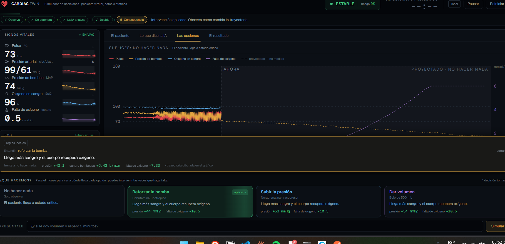
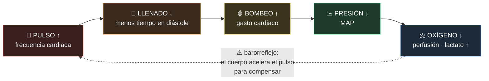
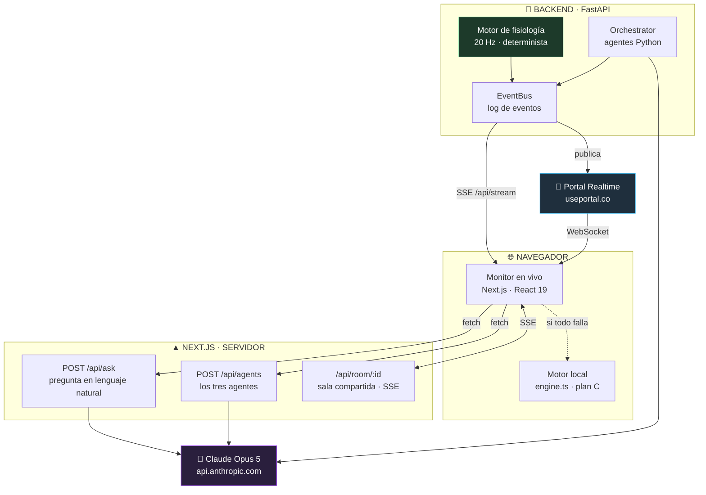
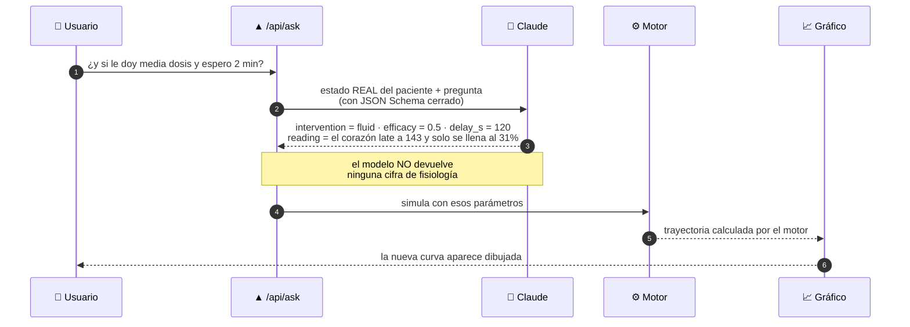
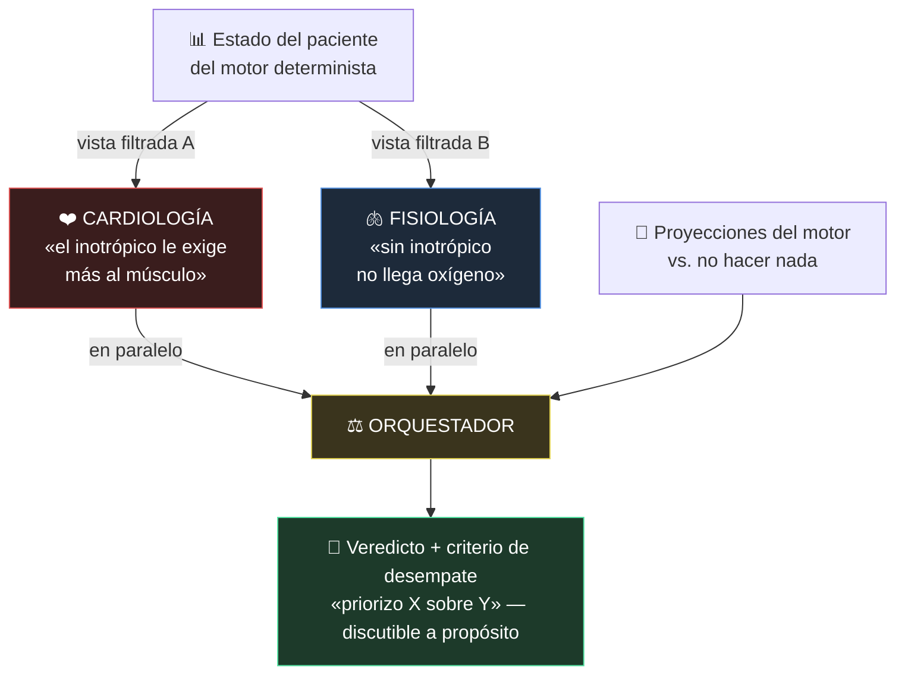
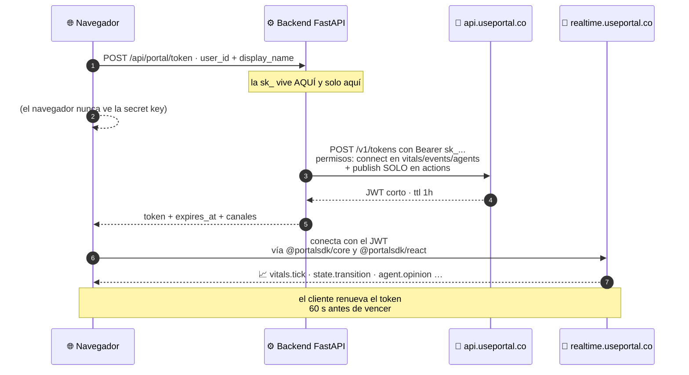

<div align="center">

# ❤️‍🔥 CARDIAC TWIN

### Un gemelo digital del corazón que te deja **ver el futuro antes de decidir**

*Un paciente virtual se deteriora en vivo. Tres agentes de IA discuten qué hacer.*
*Tú pruebas las decisiones **antes** de tomarlas y ves a dónde llevan.*

<br>

`Next.js 16` · `React 19` · `FastAPI` · `Claude Opus 5` · `Portal Realtime` · `Vercel`

<br>



<sub>Monitor en vivo · datos sintéticos · prototipo educativo, no clínico</sub>

</div>

---

## 📑 Índice

| | Sección | Para quién |
|---|---|---|
| 1 | [Qué es esto, en 30 segundos](#1--qué-es-esto-en-30-segundos) | todos |
| 2 | [El problema que resuelve](#2--el-problema-que-resuelve) | **empieza aquí** |
| 3 | [Cómo funciona: la cadena causal](#3--cómo-funciona-la-cadena-causal) | todos |
| 4 | [Arquitectura](#4--arquitectura) | técnico |
| 5 | [🧠 Cómo usamos la IA](#5---cómo-usamos-la-ia) | **clave** |
| 6 | [🔌 Cómo usamos Portal](#6---cómo-usamos-portal) | **clave** |
| 7 | [Recorrido de la demo](#7--recorrido-de-la-demo) | jurado |
| 8 | [Estructura del repositorio](#8--estructura-del-repositorio) | técnico |
| 9 | [Puesta en marcha](#9--puesta-en-marcha) | técnico |
| 10 | [API del backend](#10--api-del-backend) | técnico |
| 11 | [Cómo verificamos que no está pintado](#11--cómo-verificamos-que-no-está-pintado) | jurado |
| 12 | [Límites y honestidad clínica](#12--límites-y-honestidad-clínica) | **léelo** |

---

## 1 · Qué es esto, en 30 segundos

> Imagina un videojuego del cuerpo humano donde el paciente es real en su comportamiento,
> pero nadie sufre si te equivocas.

**Cardiac Twin** es un **gemelo digital cardíaco en tiempo real**: un simulador donde
un paciente virtual se deteriora segundo a segundo mientras tú decides qué hacer.

La pregunta que responde el producto es una sola:

<div align="center">

### ❓ *«¿Qué pasa si actuamos ahora?»*

</div>

Tres cosas ocurren a la vez en la pantalla:

```
   ┌──────────────────┐   ┌──────────────────┐   ┌──────────────────┐
   │  🫀 EL PACIENTE   │   │  🧠 LA IA         │   │  🔮 EL FUTURO     │
   │                  │   │                  │   │                  │
   │  Se deteriora    │   │  Dos especialis- │   │  Pasas el mouse  │
   │  de verdad, con  │   │  tas discuten.   │   │  sobre una       │
   │  un motor de     │   │  Un orquestador  │   │  opción y ves su │
   │  fisiología      │   │  desempata y     │   │  trayectoria     │
   │  determinista.   │   │  dice por qué.   │   │  proyectada.     │
   └──────────────────┘   └──────────────────┘   └──────────────────┘
            └──────────────────────┼──────────────────────┘
                                   ▼
                       TÚ DECIDES · Y PUEDES EQUIVOCARTE
                       (se puede intervenir varias veces y rescatar)
```

**Ningún número de la pantalla está pintado a mano.** Todos salen del motor de
fisiología. Si cambias una constante del llenado ventricular, caen en cascada la
presión, la saturación, el lactato y el tiempo hasta estado crítico.

---

## 2 · El problema que resuelve

### El problema humano

En una unidad de cuidados intensivos, la decisión correcta y la decisión que
*parece* correcta no siempre son la misma. Un monitor muestra números; no muestra
**consecuencias**. Y quien está aprendiendo no puede practicar con pacientes reales.

### El problema técnico, con nombre y apellido

Hay dos números que la gente confunde: **la presión** y **el flujo**.
La presión es el número que todos miran. El flujo es el que mantiene vivo al paciente.

Aquí está el corazón del proyecto, medido por nuestro propio motor:

| Decisión | 🩸 Presión (MAP) | 💧 Sangre bombeada | 🧪 Falta de oxígeno (lactato) | Veredicto |
|---|---|---|---|---|
| **Vasopresor** (noradrenalina) | **sube** 65 → 77 ✅ | **no mejora** 4.9 → 4.4 ❌ | no baja ❌ | *el número mejora, el paciente no* |
| **Inotrópico** (dobutamina) | sube 65 → 80 ✅ | 4.9 → **7.0** ✅ | baja ✅ | *mejora lo que importa* |

<div align="center">

> ### 💡 El vasopresor **sube el número que todos miran** mientras **hunde el que importa**.
> Una tabla de rangos no puede enseñar eso. Un gemelo digital sí.

</div>

Eso no está escrito en un texto ni actuado por un guion: **está en la física del
modelo**. Sale de dos mecanismos implementados en el motor:

- **la poscarga** — subir la resistencia vascular reduce el volumen que el corazón expulsa;
- **la perfusión depende del flujo**, no solo de la presión → `(map/85)*0.45 + (co/7.4)*0.55`

### Para quién es

| Público | Qué gana |
|---|---|
| 🎓 **Estudiantes de medicina / residentes** | Practicar razonamiento hemodinámico sin riesgo, y equivocarse a propósito |
| 👩‍🏫 **Docentes** | Un caso que se reinicia en un clic y siempre se comporta igual |
| 💻 **Cualquiera sin formación médica** | Toda la pantalla habla en español de a pie: *«el corazón late tan rápido que no alcanza a llenarse»* |

---

## 3 · Cómo funciona: la cadena causal

El corazón es una bomba. Cuando late demasiado rápido, no alcanza a llenarse entre
latido y latido, así que mueve **menos** sangre en cada uno. Late más, bombea menos.

Toda la interfaz existe para hacer visible esta cadena:



La flecha punteada es lo que hace interesante el caso: **el cuerpo se defiende
acelerando el pulso, y esa defensa empeora el problema.** Un círculo vicioso, no una
línea recta.

El motor de Python (`Backend/cardiotwin/physiology.py`) implementa esto con un modelo
**0D de dos compartimentos** (arterial y venoso) con conservación de volumen y
barorreflejo. Sin dos compartimentos la presión venosa nunca sube, y sin eso no hay
congestión ni caída de la saturación: el shock se vuelve infisiológico.

---

## 4 · Arquitectura

### Vista general



### Los tres loops que no se bloquean entre sí

El error que mata una demo así es acoplar la fisiología a la IA: un tick debe correr
a 20 Hz y una llamada a un modelo tarda entre 2 y 8 segundos. Si los acoplas, **el
monitor se congela cada vez que un agente piensa** — y eso se ve.

| Loop | Frecuencia | Qué hace | ¿Usa IA? |
|---|---|---|---|
| **1 · Fisiología** | 20 Hz | `engine.step(0.05)` | ❌ determinista |
| **2 · Publicación** | 1 Hz | publica vitales al front | ❌ |
| **3 · Agentes** | por evento | delibera sin bloquear | ✅ |

La fisiología **nunca** espera a un agente. Si un agente tarda 6 segundos, publica su
conclusión 6 segundos tarde sobre un estado que ya avanzó — que es exactamente lo que
pasa en una unidad real. Lo que no puede pasar es que el monitor se congele.

### Una sola fuente de datos, tres niveles de respaldo

Toda la interfaz lee de `usePatientState()`. Ningún componente sabe de dónde vienen
los datos, así que cambiar de fuente **no toca ni un componente**:

```
   ①  Portal (WebSocket)  ──┐
   ②  SSE  /api/stream    ──┼──►  patientStore  ──►  usePatientState  ──►  🖥️ UI
   ③  Motor local (JS)    ──┘
```

Si Portal no conecta, la interfaz muestra `SSE · respaldo` y sigue. Si el backend
tampoco está, corre el motor local en el navegador y la pantalla **lo dice**.
La demo no se cae: se degrada, y siempre confiesa en qué modo está.

---

## 5 · 🧠 Cómo usamos la IA

<div align="center">

> ### La regla de oro
> ## **La IA nunca emite un número de fisiología.**
> El modelo elige **QUÉ** hacer. El motor determinista calcula el **CÓMO**.

</div>

Esto no es una promesa en un prompt: es **estructural**. Cada llamada a Claude usa
`output_config.format: json_schema` con un espacio de salida **cerrado**. El modelo
no puede alucinar una presión arterial **porque no existe ningún campo del esquema
donde escribirla**.

```jsonc
// Frontend/src/lib/ai/contract.ts — lo ÚNICO que el modelo puede devolver
{
  "intervention": "inotrope | vasopressor | fluid | none | out_of_scope",  // enum cerrado
  "efficacy":     0.0 - 1.5,        // dosis relativa
  "delay_s":      0 - 120,          // segundos de espera
  "reading":      "texto explicativo",   // ← lo único libre, y se muestra como texto
  "echo":         "cómo entendí la pregunta"
}
```

### 5.1 · Dónde vive la IA, exactamente

| Ruta | Qué hace | Modelo |
|---|---|---|
| `POST /api/ask` | Traduce **lenguaje natural** a parámetros del motor y lee el estado actual | `claude-opus-5` |
| `POST /api/agents` | Ejecuta a los **tres agentes** (3 llamadas, no una) | `claude-opus-5` |
| `POST /api/deliberate` *(backend)* | Ronda de agentes desde el proceso que corre la fisiología | `claude-opus-5` |

La `ANTHROPIC_API_KEY` **solo vive en el servidor**. Por eso son *route handlers* de
Next y no llamadas desde el componente: la clave nunca llega al navegador.

### 5.2 · Preguntar en español — la justificación entera de la IA

Sin IA tienes cuatro botones. Con IA tienes **escenarios infinitos**:

> 💬 *«¿y si le doy volumen y lo cardiovierto en 2 minutos?»*
> 💬 *«¿qué pasa si esperamos 5 minutos más?»*
> 💬 *«¿y si el medicamento no le hace efecto?»*



Y cuando la pregunta está fuera del modelo, el sistema **lo dice**:

> *«Fuera del alcance. Este gemelo simula cuatro intervenciones sobre un corazón que
> falla como bomba.»*

Reconocer los límites en voz alta es una ventaja, no un bache.

### 5.3 · Tres agentes que discuten **de verdad**

Si le das los mismos datos y el mismo prompt a tres modelos, coinciden. Y pedirle a
uno que *«sea escéptico»* produce desacuerdo fabricado, que se nota a la legua.

**Nuestro desacuerdo es real porque cada agente tiene una función objetivo distinta
y una vista FILTRADA de los datos.** Son tres llamadas separadas, con *system prompts*
distintos y estados distintos:

| 🤖 Agente | Optimiza | ✅ Ve | 🙈 No ve *(a propósito)* |
|---|---|---|---|
| **Cardiología** | Proteger el músculo del corazón | pulso, llenado, presiones, balance de O₂ miocárdico | lactato, oxígeno sistémico |
| **Fisiología** | Que al cuerpo le llegue oxígeno | gasto cardiaco, lactato, perfusión, SpO₂ | el costo miocárdico |
| **Orquestador** | Resolver el conflicto **explícitamente** | las dos posturas + las proyecciones del motor | — |



**El conflicto sale solo, sin guionizarlo.** En shock cardiogénico el inotrópico sube
el gasto y el oxígeno que llega al cuerpo → *Fisiología lo pide*. Pero también sube la
demanda de oxígeno del propio miocardio → *Cardiología se opone*. Los dos tienen razón
**dentro de su propia función objetivo**, y el orquestador tiene que desempatar con los
números del simulador, no con retórica.

Está verificado en la física del modelo: al añadir el balance de O₂ miocárdico, el
beneficio de la dobutamina a 15 minutos **cayó de +0.86 a +0.04 L/min**. No hay que actuarlo.

> ⚠️ **Por qué no fusionamos Cardiología y Fisiología en un solo «agente clínico»:**
> un agente fusionado nunca discrepa consigo mismo. El conflicto es el mejor activo del
> sistema. Por la misma razón, el agente de Simulación **no opina** — es una herramienta:
> si opinara, duplicaría a Fisiología y el consenso sería una votación 2-1 amañada.

### 5.4 · Degradación honesta

| Situación | Qué pasa | Qué dice la pantalla |
|---|---|---|
| Hay `ANTHROPIC_API_KEY` | Claude responde | `IA` |
| No hay clave | Reglas locales deterministas con **las mismas funciones objetivo** escritas en código | `reglas locales` |
| El modelo declina o la red falla | Igual: reglas locales | `reglas locales` |
| Tarda más de 20 s | Se aborta y cae a reglas locales | `reglas locales` |

Nunca se finge que respondió un modelo cuando no lo hizo. Es la misma regla que
*«lo simulado nunca se ve como lo medido»*, aplicada a la IA.

---

## 6 · 🔌 Cómo usamos Portal

**Portal es la capa de tiempo real que sincroniza a todas las personas que están
mirando el mismo paciente.** El backend publica; los navegadores se suscriben.

<div align="center">

> ### El principio que gobierna toda la integración
> ## **El servidor es el único dueño del estado.**
> Lo que un cliente publica es una **propuesta**, jamás un hecho.

</div>

### 6.1 · Por qué la partición de canales es la que es

Portal expone **dos superficies con credenciales distintas**, y de ahí se deriva todo
el diseño:

| Superficie | Credencial | Quién la usa |
|---|---|---|
| `api.useportal.co` | *secret key* `sk_...` | **Solo el servidor.** Rechaza cualquier request con header `Origin`, así que el navegador **físicamente no puede** usarla |
| `realtime.useportal.co` | JWT de usuario | El navegador, con un token corto que **nuestro backend acuña** |

Consecuencia directa: si el navegador pudiera publicar en el canal de vitales,
cualquiera podría falsificar el estado del paciente y la demo dejaría de ser
defendible. Por eso:

| Canal | ✍️ Quién escribe | Contenido | Frecuencia |
|---|---|---|---|
| `sim:{id}:vitals` | 🔒 **solo servidor** | estado fisiológico | 1 Hz |
| `sim:{id}:events` | 🔒 **solo servidor** | transiciones de estado, umbrales cruzados, resultados de simulación | por evento |
| `sim:{id}:agents` | 🔒 **solo servidor** | ciclo de vida y opiniones de los agentes | por evento |
| `sim:{id}:actions` | 👥 **clientes** | intervenciones humanas — **propuestas** | por acción |

El JWT que acuñamos concede `connect` en los tres primeros y `publish` **solo** en
`actions` (`PortalSync.grants()`). En la práctica el navegador ni siquiera usa ese
permiso: las intervenciones viajan por `POST /api/intervention` al backend, que las
valida, las aplica al motor y **republica el resultado autoritativo** en `events`.
Es la misma regla, apretada un punto más: el cliente no tiene forma de escribir en la
línea de tiempo del paciente.

### 6.2 · El flujo del token, paso a paso



El código está en dos archivos y hace exactamente esto:

- **`Frontend/src/lib/portal.ts`** — pide el JWT, lo cachea, lo renueva 60 s antes de
  vencer, y aplica un *cooldown* de 15 s si falla para no martillar al backend.
- **`Frontend/src/components/portal/PortalBridge.tsx`** — se suscribe a los tres
  canales de lectura con el SDK oficial (`useChannel`) y vuelca cada mensaje en el
  `patientStore`. **No implementamos el wire protocol de WebSocket a mano.**

### 6.3 · Qué **no** mandamos por Portal (y por qué importa)

> 🚫 **La onda del ECG.** A 250 Hz son **75.000 mensajes en una demo de 5 minutos**.
> Te comes los límites de tasa y el costo sin ganar absolutamente nada.

En su lugar: publicamos **frecuencia y ritmo a 1 Hz** y **sintetizamos la onda en el
cliente** (`EcgStrip` genera sus propios complejos según la frecuencia). Lo mismo con
el suavizado de curvas: se interpola en el navegador entre ticks.

Además, todo mensaje pasa por un **recorte a 2 KB** (`_slim()` en `sync.py`): el
`simulation.result` completo llevaría todas las series temporales, así que por Portal
va solo el resumen y el detalle se pide por HTTP.

### 6.4 · Portal no es el bus — es un suscriptor más

Esta decisión es la que evita perder una presentación por una caída de red ajena:

```
                    ┌──────────────────────────┐
   Fisiología ──►   │      EventBus            │  ──►  🔌 Portal    (suscriptor)
   Agentes    ──►   │  (en proceso, Python)    │  ──►  📡 SSE       (suscriptor)
   Usuario    ──►   │  + log para replay       │  ──►  📜 /api/events (replay)
                    └──────────────────────────┘
```

- Si **Portal falla**, la simulación y los agentes siguen corriendo y el monitor cae
  a SSE automáticamente, mostrando `SSE · respaldo` en pantalla.
- `PortalSync.health()` expone **publicados, descartados, fallos y encolados**, y sale
  en `GET /api/health`. La degradación es observable, no un misterio.
- La cola de publicación es **ordenada y no bloqueante**: si se llena (800 mensajes),
  descarta lo más antiguo en vez de frenar la fisiología.
- **Se sincroniza el log de eventos, no el estado.** El estado se *deriva* del log, así
  que quien se conecta tarde reconstruye toda la línea de tiempo y dos personas ven lo
  mismo aunque una tenga lag.
- Los clientes **nunca simulan localmente** cuando hay servidor: divergirían.
- **La presencia sale de Portal**: el contador de *«N conectados»* del monitor es
  `presence.count` del canal `events`, no un número inventado por el front.

Y el relevo entre transportes es más fino de lo que suele hacerse: Portal conserva la
prioridad **solo mientras haya entregado una vital en los últimos 2.5 s**. Un
WebSocket abierto pero mudo no basta — si se queda callado, el siguiente tick de SSE
toma el relevo sin esperar a que el socket declare la desconexión.

### 6.5 · La sesión compartida: `/monitor?sala=uci-3`

Ver los mismos números a la vez no vale nada — para eso basta con mirar la misma
pantalla. Lo que sí cambia algo es esto:

```
   👤 Residente                    👤 Adjunto
   "propongo dobutamina"   ──►     aprueba ✅ / veta ❌
                                        │
                                        ▼
                          solo AHORA se aplica, en las dos pantallas
                          y queda constancia de quién decidió qué
```

**Nadie puede resolver su propia propuesta.** Y si estás solo, nada de esto aparece:
trabajar en equipo no debería costarle interfaz a quien trabaja solo.

**Qué corre por Portal y qué no, exactamente:**

| Pieza | Transporte hoy |
|---|---|
| Vitales, transiciones, umbrales, resultados de simulación | 🔌 **Portal** (respaldo: SSE) |
| Ciclo de vida y opiniones de los agentes | 🔌 **Portal** (respaldo: SSE) |
| Presencia — *«N conectados»* | 🔌 **Portal** (`presence.count`) |
| Aplicar una intervención | ⚙️ HTTP al backend → republicada por Portal |
| Propuesta ↔ aprobación/veto de la sala | 📡 SSE + POST en el propio Next |

El último caso es el único que no viaja por Portal: se construyó así porque el wire
protocol del canal `actions` no estaba confirmado en el OpenAPI de Portal cuando se
montó, y construir contra una especificación que no se tiene es como se pierde una
demo. Lo que sí se hizo fue **respetar la misma partición de canales** y dejar la
lógica detrás de una interfaz de publicar/suscribir, así que enchufarlo es sustituir
el transporte, no reescribir la funcionalidad.

> ⚠️ **Límite conocido:** el estado de la sala vive en memoria del proceso. Con
> `next start` (un solo proceso) funciona. En un despliegue serverless con varias
> instancias haría falta estado compartido — y ahí es exactamente donde Portal encaja.

---

## 7 · Recorrido de la demo

| ⏱️ | Qué pasa en pantalla |
|---|---|
| `0:00` | Paciente estable. El corazón late al ritmo real, los vitales fluctúan. |
| `0:30` | Se dispara el insulto. **Todavía no se ve nada** — presión 86, lactato 1.0. |
| `1:00` | **Fase compensada**: el pulso sube, la resistencia sube, la presión casi normal. *«El paciente se ve bien.»* |
| `1:30` | Se cruza un umbral → banner **HEMODINÁMICA INESTABLE**. Los agentes despiertan en pantalla. |
| `2:00` | **Tiempo estimado hasta estado crítico: 6 min**, rotulado como proyección del modelo. |
| `2:30` | Fisiología pide inotrópico. Cardiología se opone. **Conflicto real, con evidencia numérica.** |
| `3:00` | El usuario pide un **what-if**: cuatro trayectorias en paralelo sobre el gráfico. |
| `3:30` | 🎯 **El momento clave** — la noradrenalina sube la presión más que no hacer nada **y hunde el gasto más que no hacer nada.** |
| `4:00` | El orquestador desempata con los números del simulador y **declara su criterio**. El usuario decide. |
| `4:30` | Se aplica. El monitor reacciona. Los agentes re-evalúan sobre el estado nuevo. |

Y si nadie interviene:

```
   sin intervenir ................. el corazón se para a 07:48
   cualquier decisión al 2:30 ..... no hay paro
   vasopresor tarde (5:00) ........ paro a 09:56 — solo lo retrasa
```

**El corazón puede pararse de verdad**: la hipoperfusión sostenida daña la bomba
(rápido para romperse, lento para repararse) y acaba en asistolia — ECG plano, vitales
en cero, fármacos rechazados. Llegar tarde tiene que costar algo.

---

## 8 · Estructura del repositorio

```
TwinCardiaco/
├── 🐍 Backend/                      FastAPI + motor de fisiología
│   ├── cardiotwin/
│   │   ├── physiology.py           ⚙️  modelo 0D de 2 compartimentos + barorreflejo
│   │   ├── interventions.py        💊  fármacos, umbrales y compare_scenarios()
│   │   ├── runtime.py              🔄  los tres loops (20 Hz / 1 Hz / por evento)
│   │   ├── agents.py               🧠  agentes especializados + orquestador
│   │   └── sync.py                 🔌  EventBus + PortalSync  ← la integración de Portal
│   ├── server.py                    🌐  endpoints HTTP + SSE
│   ├── ARQUITECTURA.md              📐  decisiones de tiempo real, agentes y Portal
│   └── PASOS.md                     🧭  guía paso a paso para montar la demo
│
├── ▲ Frontend/                      Next.js 16 · React 19 · Tailwind 4
│   ├── src/app/
│   │   ├── page.tsx                 1️⃣  selección de paciente
│   │   ├── monitor/page.tsx         5️⃣  EL MONITOR — la pantalla que importa
│   │   └── api/
│   │       ├── ask/route.ts         🧠  pregunta en lenguaje natural → Claude
│   │       ├── agents/route.ts      🧠  los tres agentes → Claude
│   │       └── room/[id]/           👥  sala compartida (SSE + POST)
│   ├── src/lib/
│   │   ├── engine.ts                ⚙️  motor local (espejo del de Python)
│   │   ├── live.ts                  📡  puente SSE — solo traduce campos
│   │   ├── portal.ts                🔌  cliente de Portal + acuñado de JWT
│   │   ├── whatif.ts                🔮  las cuatro ramas proyectadas
│   │   ├── ai/contract.ts           📜  LOS JSON SCHEMAS — el espacio cerrado
│   │   └── session/room.ts          👥  propuestas, aprobaciones y vetos
│   ├── src/components/monitor/      🖥️  corazón latiendo, ECG, cadena causal, tendencias
│   ├── ESTADO.md                    📋  estado del proyecto y trampas ya pagadas
│   └── scripts/                     🔬  calibración y verificación sin abrir el navegador
│
├── DEPLOYMENT.md                    🚀  despliegue público en Vercel Services
└── vercel.json                      🚀  frontend en / · backend en /backend
```

---

## 9 · Puesta en marcha

### Requisitos

`Python 3.11+` · `Node 20+`

### ① Backend

```bash
cd Backend
pip install -r requirements.txt

# 8x: un deterioro de 40 minutos ocurre en 5
export CARDIOTWIN_TIME_SCALE=8
uvicorn server:app --host 0.0.0.0 --port 8000
```

Verifica: `curl localhost:8000/api/health` · documentación interactiva en `/docs`

### ② Frontend

```bash
cd Frontend
npm install
cp .env.local.example .env.local     # y rellena las claves que tengas

npm run dev      # desarrollo, puerto 3210
npm run demo     # build + start  ← ESTO es lo que se usa para presentar
```

> ⚠️ **Para presentar usa siempre `npm run demo`.** En modo desarrollo, Turbopack
> inyecta parte del CSS por JavaScript; si el servidor se reinicia con una pestaña
> abierta, el HMR se cae y la página queda con estilos parciales. Parece un bug de
> layout y no lo es.

Rutas: `/` (selección de paciente) · `/monitor` (el producto) ·
`/monitor?sala=uci-3` (sesión compartida)

### ③ Variables de entorno

| Variable | Dónde | Si falta… |
|---|---|---|
| `ANTHROPIC_API_KEY` | 🔒 servidor | Los agentes corren en **modo offline** con reglas deterministas. Todo funciona; la pantalla lo dice. |
| `PORTAL_SECRET_KEY` | 🔒 `Backend/.env` | Portal se desactiva y queda **SSE**. *Empieza así.* |
| `NEXT_PUBLIC_PORTAL_PK` | 🌐 público | El cliente no intenta conectar a Portal. |
| `NEXT_PUBLIC_CARDIOTWIN_API` | 🌐 público | Por defecto `http://localhost:8000` |
| `NEXT_PUBLIC_CARDIOTWIN_SIM_ID` | 🌐 público | Debe coincidir con `CARDIOTWIN_SIM_ID` del backend |
| `CARDIOTWIN_TIME_SCALE` | 🔒 servidor | `8` por defecto |

> 🔐 **Ninguna clave secreta lleva el prefijo `NEXT_PUBLIC_`, y ninguna se commitea.**
> La `pk_` de Portal es pública por diseño; la `sk_` solo existe en el servidor.

### ④ Despliegue

Un único proyecto de **Vercel Services**: el frontend en `/` y FastAPI en `/backend`,
sin CORS ni una segunda plataforma. Detalles en [`DEPLOYMENT.md`](DEPLOYMENT.md).

---

## 10 · API del backend

| Método | Ruta | Para qué |
|---|---|---|
| `GET` | `/api/health` | estado de Portal, LLM, agentes y clientes SSE |
| `GET` | `/api/state` | snapshot — plan B si cae el stream |
| `GET` | `/api/stream` | 📡 **SSE con todos los eventos** |
| `GET` | `/api/events?since=` | replay del log para quien llega tarde |
| `GET` | `/api/interventions` | los botones se construyen desde aquí, no hardcodeados |
| `GET` | `/api/agents` | qué ve y qué optimiza cada agente |
| `POST` | `/api/scenario/preset` | arranca el caso clínico elegido |
| `POST` | `/api/scenario/shock` | dispara el deterioro |
| `POST` | `/api/scenario/reset` | reinicia para volver a ensayar |
| `POST` | `/api/intervention` | aplica (valida y republica el resultado autoritativo) |
| `POST` | `/api/whatif` | proyecta las ramas |
| `POST` | `/api/ask` | 🧠 pregunta en lenguaje natural |
| `POST` | `/api/deliberate` | 🧠 fuerza una ronda de agentes |
| `POST` | `/api/portal/token` | 🔌 acuña el JWT del navegador |

Tipos de evento del bus: `vitals.tick` · `state.transition` · `threshold.crossed` ·
`agent.started` · `agent.opinion` · `agent.conflict` · `orchestrator.consensus` ·
`simulation.result` · `human.intervention` · `intervention.applied`

---

## 11 · Cómo verificamos que no está pintado

Estas herramientas existen para no discutir de memoria:

```bash
node scripts/calibrate.ts              # tabla del deterioro sin abrir el navegador
node scripts/calibrate-intervention.ts # respuesta a cada fármaco
node scripts/calibrate-scenarios.ts    # las ramas comparadas entre sí
node scripts/calibrate-arrest.ts       # cuándo para el corazón, con y sin intervenir
node scripts/check-room.mjs            # la sesión compartida, con dos navegadores
node scripts/console-check.mjs /       # errores del navegador por ruta
npm run shot                           # captura a 1840×1230 + recortes por zona
```

Las pantallas aceptan `?t=130&freeze=1` para congelar un estado reproducible.

---

## 12 · Límites y honestidad clínica

<div align="center">

> ## ⚠️ Esto **no** tiene utilidad clínica y no debe presentarse como si la tuviera.
> No diagnostica · no recomienda tratamientos · no está validado contra pacientes.

</div>

Somos explícitos sobre exactamente qué es cada cosa:

| Lo que parece | Lo que realmente es |
|---|---|
| «Tiempo hasta estado crítico» | Una **extrapolación lineal** de la pendiente actual del propio modelo. Si preguntan contra qué está validado, la respuesta honesta es *«contra nada»*. |
| Los porcentajes de confianza | Literales en el código, no una estimación estadística. |
| Los coeficientes de los fármacos | **Plausibles**, no medidos. Modelo de parámetros agrupados. |
| El paciente | **Sintético y genérico.** No se usan datos de pacientes reales. |

**Lo que sí se sostiene:** es un **simulador para enseñar razonamiento hemodinámico**.
La cadena causal es fisiología de libro, y la disociación entre presión y flujo con
vasopresores es un concepto clínico establecido.

Declarar el límite **antes** de que lo pregunten es lo que da credibilidad al resto.

### Reglas duras que el proyecto se autoimpone

1. 🔵 **Lo simulado nunca se ve como lo medido.** Toda proyección va punteada, más
   tenue y rotulada `PROYECTADO`. Si alguien confunde una proyección con una medición,
   el proyecto falla en su premisa.
2. ⚙️ **El frontend no calcula fisiología.** El motor vive aislado; los componentes
   solo dibujan.
3. 🗣️ **Lenguaje humano primero.** *«El corazón bombea 40% menos»*, no *«taquiarritmia
   con compromiso hemodinámico»*. El término técnico va al lado, en pequeño, para que
   un médico vea que está bien hecho.
4. 🔢 **Ningún agente emite una cifra que no venga del motor**, y cada hallazgo trae su
   evidencia.

---

<div align="center">

### Atribución

Si se habilita la vista anatómica 3D:
**Modelo anatómico: BodyParts3D, Database Center for Life Science — CC BY-SA 2.1 JP**

<br>

🫀 · Todos los datos son sintéticos · Prototipo educativo · No es un dispositivo médico

</div>
